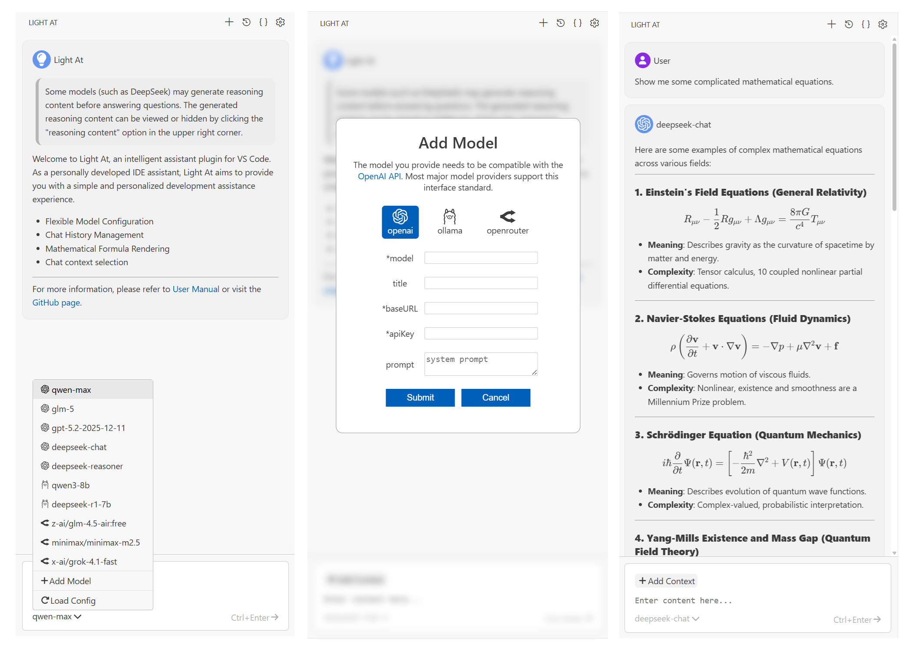
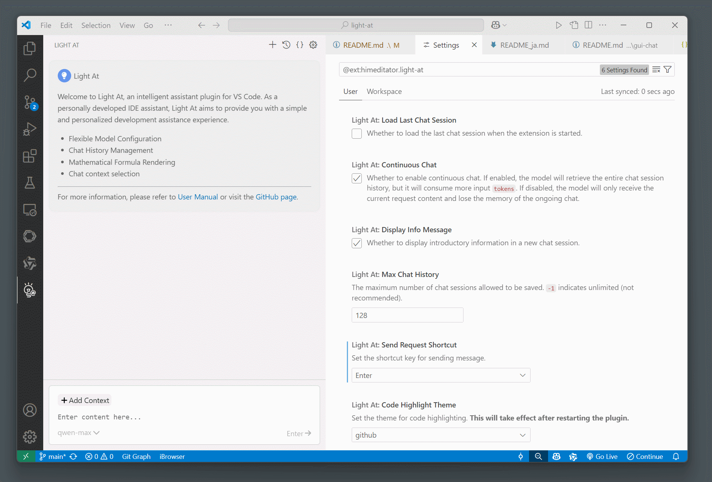
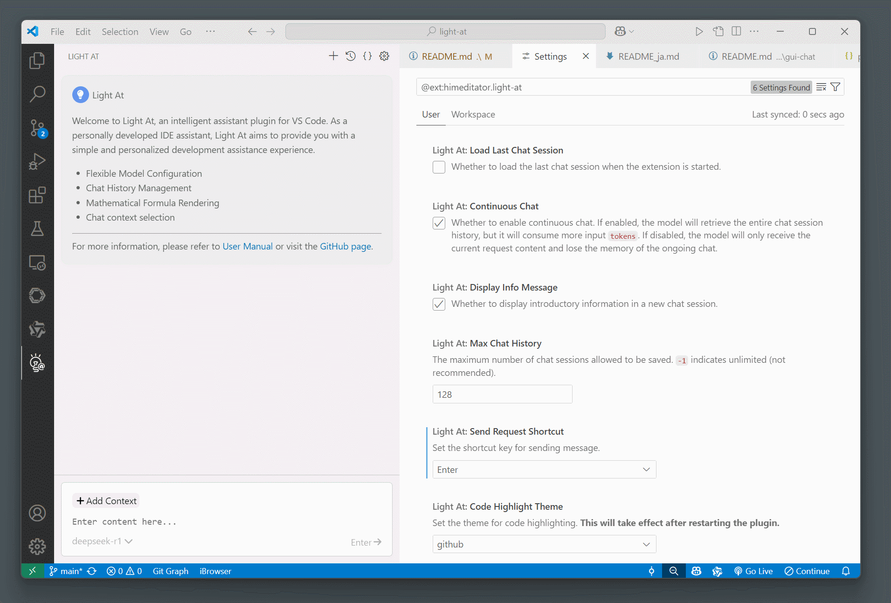
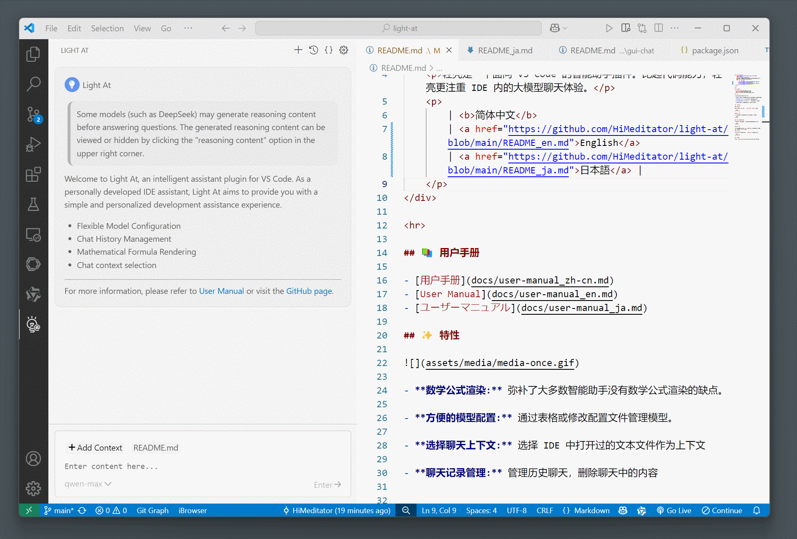
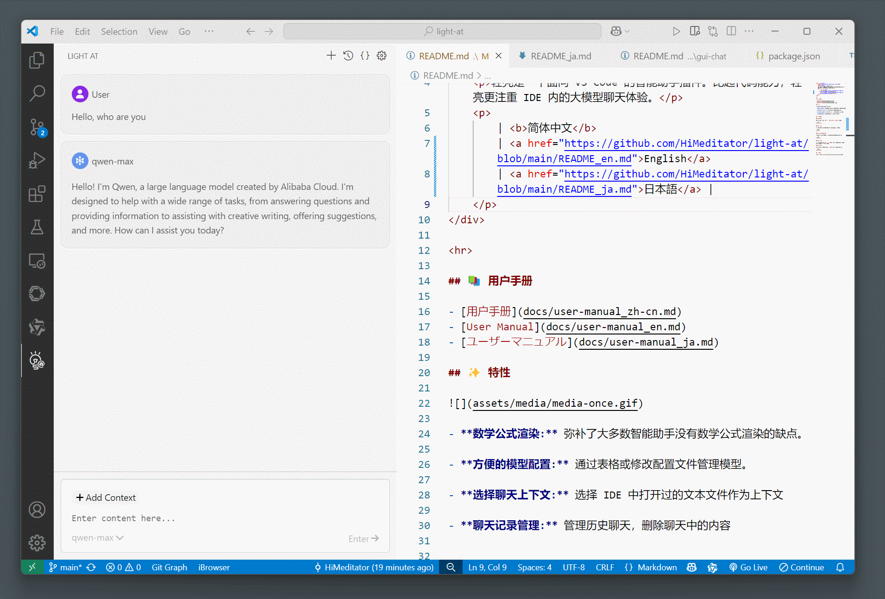

<div align="center">
    
    <h1 align="center">light-at</h1>
    <p>Light At は、VS Code 派生 IDE 向けのプラグインであり、最も純粋な IDE 内大規模モデルテキストチャット機能のみを提供します。</p>
    <p>
      <a href="https://github.com/HiMeditator/light-at/releases"></a>
      <a href="https://github.com/HiMeditator/light-at/issues"></a>
      
      
    </p>
    <p>
        | <a href="https://github.com/HiMeditator/light-at/blob/main/README.md">简体中文</a>
        | <a href="https://github.com/HiMeditator/light-at/blob/main/README_en.md">English</a>
        | <b>日本語</b> |
    </p>
</div>

> 本バージョンは長期安定版であり、今後積極的なアップデートは行われません。本プロジェクトをベースとした新プロジェクト：[Light Mate](https://github.com/HiMeditator/light-mate) 。
>
> <details>
> <summary>Light Mate</summary>
> <p> VS Code向けの軽量な大規模言語モデルエージェントプラグイン。より少ないトークン消費量で軽量タスクを完了します。</p>
> </details>

<hr>



## 📥 ダウンロード

<a href="https://github.com/HiMeditator/light-at/blob/main/packages/extension/CHANGELOG.md">チェンジログ</a>

- [Visual Studio Marketplace](https://marketplace.visualstudio.com/items?itemName=himeditator.light-at)

- [Github Release](https://github.com/HiMeditator/light-at/releases)

## 📚 ユーザーマニュアル

- [用户手册](docs/user-manual_zh-cn.md)
- [User Manual](docs/user-manual_en.md)
- [ユーザーマニュアル](docs/user-manual_ja.md)

## ✨ 特徴

> 本プロジェクトは2025年3月に開始されました。当時、市場にあったIDEの大規模言語モデルチャットプラグインの多くはコード機能を中心としており、数式のレンダリングをサポートしていないものがほとんどでした。本プラグインは、IDE内で純粋な大規模言語モデルとのテキストチャット体験を提供することを目標に開発されました。

- **複数モデルのサポート:** OpenAI互換API、OllamaおよびOpenRouterが利用可能。
- **数学公式レンダリング:** 多くのスマートアシスタントが欠いている数学公式のレンダリング機能を補完します。
- **便利なモデル設定:** テーブルや設定ファイルの編集を通じてモデルを管理できます。
- **チャットコンテキストの選択:** IDE で開いたテキストファイルを選んでコンテキストとして使用できます。
- **チャット履歴管理:** 過去のチャットを管理し、チャット内の内容を削除できます。

### ♾️ 数式のレンダリング



### 📝 モデル設定



### 📋 チャットコンテキストの選択



### 💬 チャット履歴の管理




## 🚀 プロジェクトの実行

このプロジェクトは [light-assistant](https://github.com/HiMeditator/light-assistant) をベースにリファクタリングしたもので、プロジェクト構造を最適化し、フロントエンドを Vue 3 で再構築しています。

### 依存関係のインストール

環境に `pnpm` がない場合は、まず `npm install -g pnpm` を実行してインストールしてください。

```bash
pnpm install
```

### フロントエンドの実行

このコマンドでフロントエンドを実行すると、VS Code に接続されず、対話ができません。

```bash
pnpm dev
```

### フロントエンドの内容をプラグインにパッケージ化

フロントエンドの変更後は、このコマンドを実行してプラグインに内容を更新する必要があります。

```bash
pnpm build
```

### プラグインの実行

VS Code を使用し、`実行 > デバッグの開始` からプラグインを実行します。Windows ユーザーはショートカットキー `F5` を使用してプラグインを実行することもできます。

### プラグインのパッケージ化

パッケージ化する前に、フロントエンドの変更が `pnpm build` によってプラグインに更新されていることを確認してください。

```bash
pnpm package
```

## 👏 謝辞

プラグインアイコンは [Duetone](assets/icons/credits.md) の作品を改変しています。

本プロジェクトの Markdown レンダリングには、以下のサードパーティライブラリを使用しています：

- Markdown パース：[marked](https://github.com/markedjs/marked)
- 数式レンダリング：[katex](https://github.com/KaTeX/KaTeX)
- コードシンタックスハイライト：[highlight.js](https://github.com/highlightjs/highlight.js)
